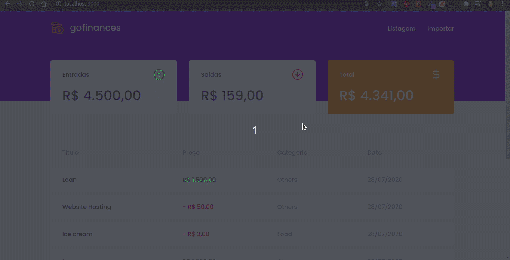

<h3 align="center">
  Desafio 07: GoFinances Web
</h3>

<blockquote align="center">“Não espere resultados brilhantes se suas metas não forem claras”!</blockquote>

  

  

## Apresentação:

  

## :rocket: Sobre o desafio

O objetico de desafio é integrar todo o backend desenvolvido no desafio 06 ao frontend de forma interativa.

### Funcionalidades da aplicação

- **`Listar as transações da sua API`**: A página deve ser capaz de listar todas as transações realizadas dentro do banco de dados, como entradas, saídas e o total.

- **`Exibir o balance da API`**: Como dito anteriormente, a aplicação deve ser capaz de exibir em blocos o balanceamento financeiro.

- **`Importar arquivos CSV`**: Na página de `importação` deve ser possível importar arquivos csv contendo informações relevantes ao banco de dados por meio de um drag-n-drop (arrastar e soltar) ou por meio da raiz de arquivos do sistema.

### Específicação dos testes

Para esse desafio, temos os seguintes testes:

- **`should be able to list the total balance inside the cards`**: Para que esse teste passe, a aplicação deve permitir que seja exibido na Dashboard, cards contendo o total de `income`, `outcome` e o total da subtração de `income - outcome` que são retornados pelo balance do backend.

* **`should be able to list the transactions`**: Para que esse teste passe, a aplicação deve permitir que sejam listados dentro de uma tabela, toda as transações que são retornadas do backend.

- **`should be able to navigate to the import page`**: Para que esse teste passe, deve permitir a troca de página através do Header, pelo botão que contém o nome `Importar`.

- **`should be able to upload a file`**: Para que esse teste passe, deve ser possível que um arquivo seja enviado através do componente de drag-n-drop na página de `import`, e que seja possível exibir o nome do arquivo enviado para o input.

---

Feito com 💜 by Teuuz1994 :wave:
